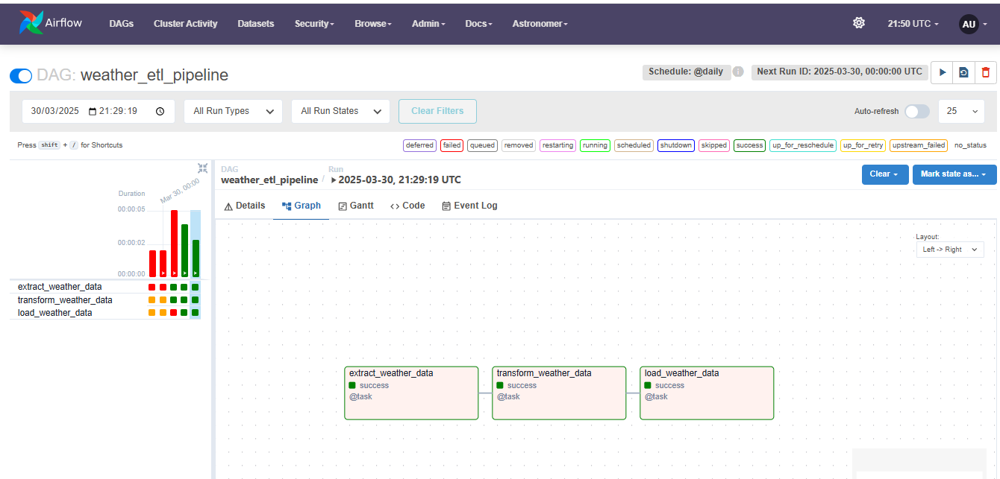

# ETL Weather Pipeline

This project demonstrates an ETL pipeline built with **Apache Airflow** to extract weather data from the **Open-Meteo API**, transform it, and load it into a **PostgreSQL database**.


## Prerequisites

- **Airflow**
- **Astro**
- **PostgreSQL**
- **Open-Meteo API**

## Setup

### 1. Install Astro and Airflow
Follow the installation guides:
- [Install Astro](https://astro.build/docs/get-started)
- [Install Apache Airflow](https://airflow.apache.org/docs/apache-airflow/stable/installation/index.html)

### 2. Configure Airflow Connections
Set up these connections in Airflow:
- **Open-Meteo API** connection (`open_meteo_api`)
- **PostgreSQL** connection (`postgres_default`)

### 3. Postgres Setup
Ensure PostgreSQL is running and create the necessary database for weather data storage.

### 4. DAG File
The pipeline logic is defined in the `etlweather.py` file:
- **Extract**: Fetches weather data from Open-Meteo API.
- **Transform**: Transforms the weather data.
- **Load**: Loads the transformed data into PostgreSQL.

### 5. Run the Pipeline
- Use Astro to orchestrate the DAG.
```bash
astro dev start
